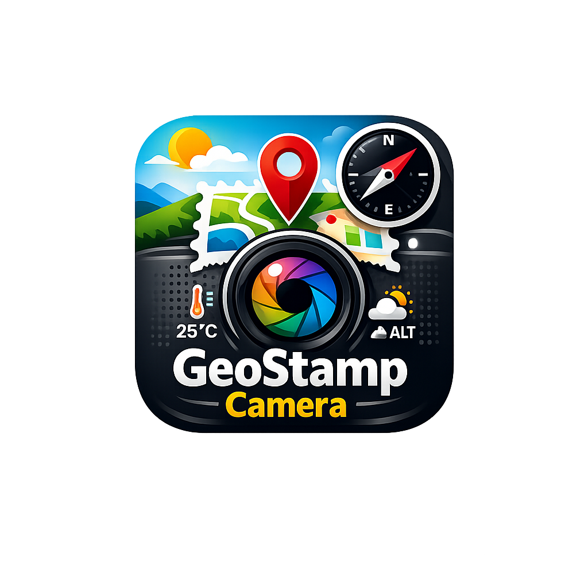

<p align="center">
  
</p>

<h1 align="center">GeoStamp Camera</h1>

<p align="center">
  <strong>A clean, modern GPS camera app for Android that stamps location, weather, and map data onto your photos.</strong>
</p>

<p align="center">
  
  
  
  
  
</p>

<p align="center">
  <a href="#features">Features</a> &nbsp;&bull;&nbsp;
  <a href="#api-providers">API Providers</a> &nbsp;&bull;&nbsp;
  <a href="#architecture">Architecture</a> &nbsp;&bull;&nbsp;
  <a href="#project-structure">Project Structure</a> &nbsp;&bull;&nbsp;
  <a href="#setup">Setup</a> &nbsp;&bull;&nbsp;
  <a href="#permissions">Permissions</a> &nbsp;&bull;&nbsp;
  <a href="#compatibility">Compatibility</a> &nbsp;&bull;&nbsp;
  <a href="#contributing">Contributing</a>
</p>

---

## What is GeoStamp Camera?

GeoStamp Camera automatically captures GPS location data, weather conditions, altitude, compass direction, and a map snapshot — then stamps all of it directly onto your photo. Perfect for site documentation, travel photography, surveying, and any work that requires geotagged proof-of-location images.

Built with modern Android development practices. No ads. No tracking. Fully open source.

---

## Features

### Camera
- Full-screen CameraX preview
- Front and rear camera switching
- Flash toggle
- Rule-of-thirds grid overlay
- Self-timer (3s, 5s, 10s)
- Aspect ratio selection (4:3, 16:9, 1:1)
- Mirror mode for front camera
- Shutter sound toggle

### GPS & Location
- Real-time GPS coordinates via FusedLocationProviderClient
- Automatic reverse geocoding (coordinates to readable address)
- Altitude tracking
- Manual location input option (latitude/longitude)

### Map Snapshot
- Generates a small map preview embedded in the photo stamp
- Supports Normal, Satellite, Terrain, and Hybrid map styles
- Configurable map size (Small, Medium, Large)

### Weather Data
- Current temperature and weather description
- Celsius / Fahrenheit toggle

### Compass
- Real-time compass direction using device sensors (accelerometer + magnetometer)
- Shows cardinal direction (N, NE, E, SE, S, SW, W, NW) and degree heading

### Photo Stamping
- Overlays all collected data onto the captured photo using Canvas rendering
- 6 built-in stamp templates:

| Template | Description |
|----------|-------------|
| **Classic** | Traditional layout with map on right, text on left |
| **Modern** | Clean layout with map on left and bold text |
| **Minimal** | Compact stamp with essential info only |
| **Survey** | Detailed data layout for site documentation |
| **Travel** | Top banner with centered map for travel photos |
| **Professional** | Right-aligned text with left map for reports |

- Customizable font size, font color, text alignment, and background opacity
- Optional custom text stamp

### File Management
- Saves photos with full EXIF metadata (GPS, altitude, timestamp)
- Configurable image quality (Low / Medium / High / Maximum)
- Smart file naming: `CITY_DATE_TIME.jpg`, `DATE_TIME.jpg`, or sequential
- Custom save folder selection

### Settings
- 10 categories with 35+ configurable options
- All settings persisted via Jetpack DataStore
- Light / Dark / System theme modes

---

## API Providers

GeoStamp Camera supports **both free and paid** data providers. You can choose your preferred provider in **Settings → Map Settings** and **Settings → Weather Settings**.

### Map Providers

| Provider | Cost | API Key Required | Notes |
|----------|------|------------------|-------|
| **OpenStreetMap** (default) | Free | No | Uses OSM tile servers. No setup needed. |
| **Google Maps Static API** | Free tier: $200/month credit (~28k requests) | Yes | Enter your own key in Settings. Get one at [Google Cloud Console](https://console.cloud.google.com). |
| **MapmyIndia / Mappls** | Free tier available | Yes | Indian map provider with detailed India coverage. Get a key at [mappls.com](https://www.mappls.com). |

#### Project Metadata (Required for API Registration)

When registering for Google Maps or Mappls APIs, use these credentials:

- **Package Name:** `com.geostampcamera`
- **SHA-256 Fingerprint:** `BA:46:C8:D8:1A:AF:1C:71:81:12:33:62:8C:ED:D2:EF:04:7D:51:6B:38:ED:5B:4A:2A:94:0D:51:9C:D9:65:DC`

#### How to get a MapmyIndia / Mappls API Key

1. Go to [Mappls API Dashboard](https://apis.mappls.com/console/)
2. Create a free account
3. Create a new project and generate a **REST API Key**
4. Copy the key and paste it in **Settings → API Keys → MapmyIndia / Mappls API Key**
5. Tap **Test Key** to verify it works
6. Select **MapmyIndia / Mappls** as your Map Provider in Settings

### Weather Providers

| Provider | Cost | API Key Required | Notes |
|----------|------|------------------|-------|
| **Open-Meteo** (default) | Free | No | No account needed. Supports current weather worldwide. |
| **OpenWeather** | Free tier: 1,000 calls/day | Yes | Enter your own key in Settings. Sign up at [openweathermap.org](https://openweathermap.org/api). |

### Automatic Fallback

If a paid API key is invalid, expired, or hits its rate limit, the app **automatically falls back** to the free provider (OpenStreetMap / Open-Meteo) so your photos are never affected. A popup will notify you when this happens.

> The app works immediately out of the box with the free providers. No API keys or accounts needed.

---

## Architecture

```
MVVM + Clean Architecture
```

```
UI Layer (Jetpack Compose)
    |
ViewModels (Hilt-injected)
    |
    +-- Repositories (DataStore, MediaStore)
    +-- Services (Location, Weather, Compass, Maps)
    +-- StampRenderer + TemplateEngine
    +-- CameraManager (CameraX)
```

### Tech Stack

| Layer | Technology |
|-------|-----------|
| UI | Jetpack Compose + Material 3 |
| DI | Hilt |
| Camera | CameraX |
| Location | FusedLocationProviderClient + Geocoder |
| Networking | Retrofit + OkHttp |
| Image Loading | Coil |
| Persistence | DataStore Preferences |
| Navigation | Jetpack Navigation Compose |
| EXIF | AndroidX ExifInterface |
| QR Scanner | MLKit Barcode Scanning |

---

## Project Structure

```
app/src/main/java/com/geostampcamera/
|-- GeoStampApp.kt                    # Hilt Application
|-- MainActivity.kt                   # Single Activity entry point
|-- MainViewModel.kt                  # Theme observer
|
|-- camera/
|   +-- CameraManager.kt             # CameraX binding and capture
|
|-- core/
|   |-- permissions/
|   |   +-- PermissionHelper.kt       # Runtime permission helpers
|   +-- utils/
|       |-- Constants.kt              # App-wide constants
|       +-- ExifHelper.kt             # EXIF metadata writer
|
|-- data/
|   |-- datastore/
|   |   +-- DataStoreManager.kt       # DataStore read/write with type-safe keys
|   |-- model/
|   |   |-- AppSettings.kt            # All enums + settings data class
|   |   +-- PhotoMetadata.kt          # Captured photo metadata model
|   |-- remote/
|   |   +-- WeatherApi.kt             # Retrofit interfaces for weather APIs
|   +-- repository/
|       |-- PhotoRepository.kt        # Photo save + naming logic
|       +-- SettingsRepository.kt     # Settings persistence wrapper
|
|-- di/
|   +-- AppModule.kt                  # Hilt dependency providers
|
|-- location/
|   +-- LocationService.kt            # GPS + reverse geocoding
|
|-- maps/
|   +-- MapSnapshotGenerator.kt       # Map tile/snapshot generation
|
|-- navigation/
|   +-- NavGraph.kt                   # App navigation routes
|
|-- sensor/
|   +-- CompassService.kt             # Compass via device sensors
|
|-- stamp/
|   |-- StampRenderer.kt              # Canvas-based stamp overlay
|   +-- TemplateEngine.kt             # Template layout definitions
|
|-- ui/
|   |-- camera/
|   |   |-- CameraScreen.kt           # Camera preview + controls
|   |   +-- CameraViewModel.kt        # Capture orchestration
|   |-- components/
|   |   +-- SettingsComponents.kt     # Reusable settings UI widgets
|   |-- preview/
|   |   +-- PhotoPreviewScreen.kt     # Stamped photo preview + share
|   |-- settings/
|   |   |-- SettingsScreen.kt         # Full settings UI
|   |   +-- SettingsViewModel.kt      # Settings state management
|   |-- template/
|   |   +-- TemplateSelectorScreen.kt # Visual template picker
|   +-- theme/
|       +-- Theme.kt                  # Material 3 theme + colors
|
+-- weather/
    +-- WeatherService.kt             # Dual-provider weather fetching
```

---

## Setup

### Prerequisites

- Android Studio Ladybug (2024.2) or newer
- JDK 17
- Android SDK 35

### Build & Run

1. Clone the repository:
   ```bash
   git clone https://github.com/aquib4040/geocam.git
   cd geocam
   ```

2. Open the project in Android Studio

3. Wait for Gradle sync to complete

4. Connect a device or start an emulator (API 29+)

5. Click **Run**

> No API keys needed. The app uses free providers by default.

### Optional: Enable Paid Providers

To use Google Maps or OpenWeather, open the app **Settings** and:

1. Go to **Map Settings** > change provider to **Google Maps** > enter your API key
2. Go to **Weather** > change provider to **OpenWeather** > enter your API key

---

## Permissions

| Permission | Purpose |
|-----------|---------|
| `CAMERA` | Photo capture |
| `ACCESS_FINE_LOCATION` | GPS coordinates |
| `ACCESS_COARSE_LOCATION` | Approximate location fallback |
| `INTERNET` | Weather data and map tiles |
| `READ_MEDIA_IMAGES` | Gallery access (Android 13+) |

---

## Compatibility

| | Version |
|---|---------|
| **Minimum** | Android 10 (API 29) |
| **Target** | Android 15 (API 35) |
| **Tested on** | Android 10 through Android 15 |

---

## Contributing

Contributions are welcome! Please:

1. Fork the repository
2. Create a feature branch (`git checkout -b feature/your-feature`)
3. Commit your changes (`git commit -m 'Add your feature'`)
4. Push to the branch (`git push origin feature/your-feature`)
5. Open a Pull Request

---

## License

This project is licensed under the MIT License. See [LICENSE](LICENSE) for details.

---

<p align="center">
  Made with Kotlin and Jetpack Compose
</p>
